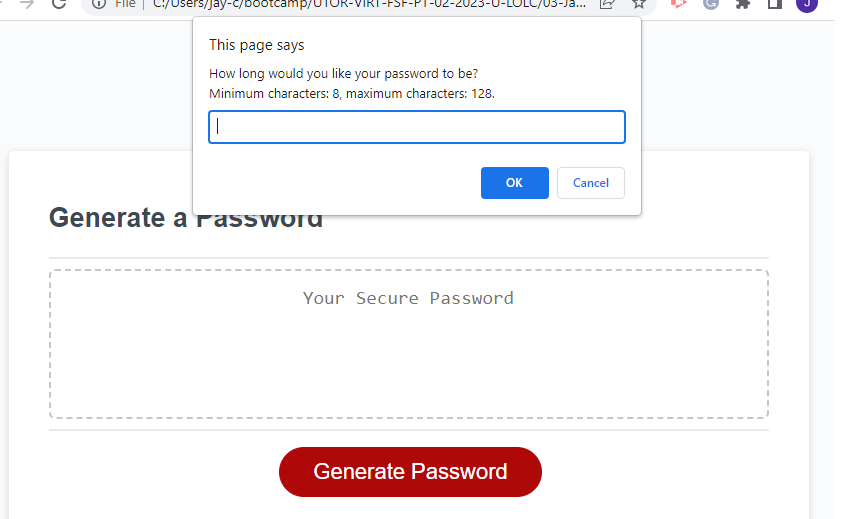

# Password-Generator
## 03 JavaScript: Password Generator

So in week 3, I’ve learned some JavaScript. In this challenge, I had to add code into a given JavaScript template to randomly generate a password within a given criteria. Honestly, I did not feel very confident going into this project. I am definitely going to have to do some extra learning/understanding to solidify these concepts. 

For this, I had to break it down into more manageable sections: 
- make variables to group the characters that will be used (eg. upperCASE, lowerCase, numbers, specialChar). I made these into a string (act similar to arrays without some methods, but didn’t need those in this challenge).
- make prompts for the user to input what they want for their password:  Length(prompt), and which character-sets they’d like to use(confirm) 
- password LENGTH criteria: length of at least 8 characters, max of 128. And has to be a number (realised that in the prompt I could add letters which isn’t useful here, so wanted to rule out anything that wasn’t a number). →  If these conditions are not met, prompt them again until user complies. 
- password CHARACTER criteria: must choose at least one character-set so we have characters to work with in the password! If they don’t choose at least one, ask again before they can continue. 
- when character-sets are selected, 2 things need to happen: 
1. Add the characters in the character-set to a list of selectedCharacters
2. Add ONE RANDOM character from the character-set to the newPassword (this is to ensure that the newPassword WILL contain AT LEAST one character from the character-set selected)
- take the selectedCharacters and RANDOMLY select a character from it to add to the newPassword, making sure that the length of newPassword is the same as the Length the user chose. 
- link it all to the HTML to make the webpage work. 

It took a lot of tinkering and playing around for me to find where to put things so they worked how I wanted them! I'm a bit stressed about the upcoming weeks now.


## Table of Contents

- [Deployment](#deployment)
- [Requirements](#requirements)
- [Usage](#usage)
- [Citations](#citations)
- [License](#license)

## Deployment

Link to my Password Generator: 

**https://jaychan0125.github.io/Password-Generator/**

## Requirements

Here are the User Story and Acceptance Criteria provided: 
> ### User Story
```
AS AN employee with access to sensitive data
I WANT to randomly generate a password that meets certain criteria
SO THAT I can create a strong password that provides greater security
```
>
> ### Acceptance Criteria
```
GIVEN I need a new, secure password
WHEN I click the button to generate a password
THEN I am presented with a series of prompts for password criteria
WHEN prompted for password criteria
THEN I select which criteria to include in the password
WHEN prompted for the length of the password
THEN I choose a length of at least 8 characters and no more than 128 characters
WHEN asked for character types to include in the password
THEN I confirm whether or not to include lowercase, uppercase, numeric, and/or special characters
WHEN I answer each prompt
THEN my input should be validated and at least one character type should be selected
WHEN all prompts are answered
THEN a password is generated that matches the selected criteria
WHEN the password is generated
THEN the password is either displayed in an alert or written to the page
```
>

## Usage



When you enter the webpage, nothing happens until you click the big, red, Generate Password button. After that, a prompt will pop up asking you to enter your desired password length (with conditions). If you don't fill the conditionrs, the prompt will continue until satisfied. 


You'll then be prompted to choose what character-sets you'd like in your password! If you don't choose at least one set, you'll get an alert: 


Once everything has been entered, you'll then get a password displayed!! 


## Citations

Maqsood, A., Moatar, T., Krishna, &amp; Zhang, S. (2023). JavaScript Day 1-3. Lecture. 


## License

Licensed under the MIT license.

---
